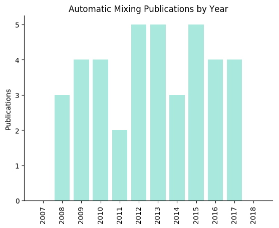
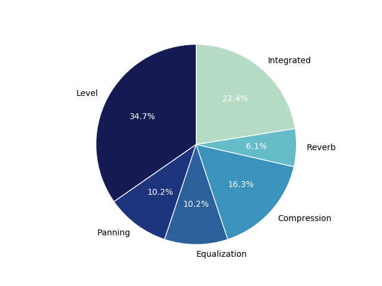
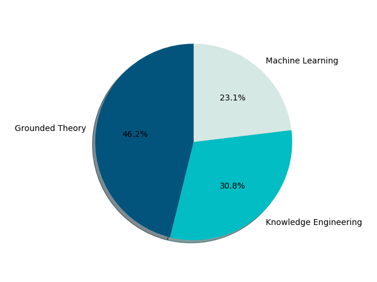

# Automatic Mixing Research
This list serves to track and archive scientific work in the area of automatic multitrack audio mixing.

## Overview
Mixing is a complex process carried out by audio engineers during the music production process. It involves a number of different steps each of which oftentimes have many substeps dependent on the source material and the desired result. In order to better categorize the work in this area the following mix processes are identified.

* `Level`
* `Panning`
* `Equalization`
* `Compresssion`
* `Reverb`

Systems that incorporate more than one procees are categorized as `integrated`.
## Level
|Year|Title|Authors|Approach|Resources|
|---|---|---|---|---|
|2015|[Comparison of loudness features for automatic level adjustment in mixing](http://www.aes.org/e-lib/browse.cfm?elib=17928)|G. Wichern et al.|KE|No|
|2014|[The mathematics of mixing](http://www.aes.org/tmpFiles/elib/20171227/17081.pdf)|M. J. Terrell, A. Simpson, and M. Sandler|GT|No|
|2012|[Implementation and evaluation of autonomous multi-track fader control](http://citeseerx.ist.psu.edu/viewdoc/download?doi=10.1.1.725.3873&rep=rep1&type=pdf)|S. Mansbridge, S. Finn, and J. D. Reiss|GT|No|
|2012|[An offline, automatic mixing method for live music, incorporating multiple sources, loudspeakers, and room effects](http://ieeexplore.ieee.org/document/6791175)|M. J. Terrell and M. Sandler|GT|No|
|2012|[Multitrack mixing using a model of loudness and partial loudness](https://www.eecs.qmul.ac.uk/~josh/documents/WardReissAthwal-AES133-Multitrackmixingusingamodelofloudnessandpartialloudness.pdf)|D.Ward, J. D. Reiss, and C. Athwal|GT|No|
|2011|[Automatic multi-track mixing using linear dynamical systems](http://music.ece.drexel.edu/files/Navigation/Publications/Scott2011a.pdf)|J. Scott et al.|ML|[Yes](http://music.ece.drexel.edu/research/AutoMix/lds)|
|2011|[Analysis of acoustic features for automated multi-track mixing](http://music.ece.drexel.edu/files/Navigation/Publications/Scott2011b.pdf)|J. Scott and Y. E. Kim|ML|No|
|2009|[Automatic gain and fader control for live mixing](https://www.researchgate.net/publication/224086775_Automatic_gain_and_fader_control_for_live_mixing)|E. Perez Gonzalez and J. D. Reiss|GT|No|
|2009|[Automatic equalization of multichannel audio using cross-adaptive methods](https://www.researchgate.net/publication/277836816_Automatic_Equalization_of_Multichannel_Audio_Using_Cross-Adaptive_Methods)|E. Perez Gonzalez and J. D. Reiss|GT|No|
|2009|[Automatic monitor mixing for live musical performance](http://www.aes.org/e-lib/browse.cfm?elib=15229)|M. J. Terrell and J. D. Reiss|KE|No|
|2008|[An automatic maximum gain normalization technique with applications to audio mixing](http://www.aes.org/e-lib/browse.cfm?elib=14541)|E. Perez Gonzalez and J. D. Reiss|GT|No|
|2008|[A framework for automatic mixing using timbral similarity measures and genetic optimization](http://www.aes.org/e-lib/browse.cfm?elib=14626)|B. Kolasinski|ML|[Yes](http://www.nyu.edu/projects/mtr/)|
## Panning
|Year|Title|Authors|Approach|Resources|
|---|---|---|---|---|
|2014|[A cross-adaptive dynamic spectral panning technique](http://www.dafx14.fau.de/papers/dafx14_pedro_d._pestana_a_cross_adaptive_dynamic_.pdf)|P. D. Pestana and J. D. Reiss|GT|No|
|2012|[An autonomous system for multitrack stereo pan positioning](http://www.eecs.qmul.ac.uk/~josh/documents/MansbridgeFinnReiss-AES133-Autonomoussystemformultitrackstereopositioning.pdf)|S. Mansbridge, S. Finn, and J. D. Reiss|KE|No|
|2010|[A real-time semiautonomous audio panning system for music mixing](https://asp-eurasipjournals.springeropen.com/articles/10.1155/2010/436895)|E. Perez Gonzalez and J. D. Reiss|GT|No|
## Equalization
|Year|Title|Authors|Approach|Resources|
|---|---|---|---|---|
|2015|[Autonomous multitrack equalization based on masking reduction](http://www.eecs.qmul.ac.uk/~josh/documents/2015/Hafezi%20Reiss%20-%202015.pdf)|S. Hafezi and J. D. Reiss|GT|No|
|2013|[Automated tonal balance enhancement for audio mastering applications](http://www.aes.org/e-lib/browse.cfm?elib=16737)|S. I. Mimilakis et al|GT|No|
|2013|[Implementation of an intelligent equalization tool using Yule-Walker for music mixing and mastering](http://www.eecs.qmul.ac.uk/~josh/documents/Ma%20Reiss-%20Implementation%20of%20an%20Intelligent%20Equalization%20Tool%20Using%20Yule-Walker%20for%20Music%20Mixing%20and%20Mastering.pdf)|Z. Ma, J. D. Reiss, and D. A. A. Black|KE|No|
|2009|[Automatic equalization of multichannel audio using cross-adaptive methods](http://www.aes.org/e-lib/browse.cfm?elib=15026)|E. Perez Gonzalez and J. D. Reiss|GT|No|
## Compression
|Year|Title|Authors|Approach|Resources|
|---|---|---|---|---|
|2015|[Adaptive audio reproduction using personalized compression](https://www.eecs.qmul.ac.uk/~josh/documents/2015/Mason%20et%20al%20-%20AES57%20-%202015.pdf)|A. Mason et al.|GT|No|
|2015|[Intelligent multitrack dynamic range compression](http://www.aes.org/e-lib/browse.cfm?elib=17821)|Z. Ma et al.|KE|No|
|2014|[A statistical approach to automated offline dynamic processing in the audio mastering process](http://www.dafx14.fau.de/papers/dafx14_marcel_hilsamer_a_statistical_approach_to.pdf)|M. Hilsamer and S. Herzog|GT|No|
|2013|[Parameter automation in a dynamic range compressor](http://www.aes.org/e-lib/browse.cfm?elib=16965)|D. Giannoulis, M. Massberg, and J. D. Reiss|KE|No|
|2012|[An autonomous method for multi-track dynamic range compression](https://www.dafx12.york.ac.uk/papers/dafx12_submission_6.pdf)|J. A. Maddams, S. Finn, and J. D. Reiss|GT|No|
|2010|[Automatic noise gate settings for drum recordings containing bleed from secondary sources](https://dl.acm.org/citation.cfm?id=1972713)|M. J. Terrell, J. D. Reiss|KE|No|
## Reverb
|Year|Title|Authors|Approach|Resources|
|---|---|---|---|---|
|2017|[Intelligent multitrack reverberation based on hinge-loss markov random field](http://www.aes.org/e-lib/browse.cfm?elib=18766)|A. L. Benito and J. D. Reiss|ML|[Yes](https://code.soundsoftware.ac.uk/projects/multitrackreverb)|
## Integrated
|Year|Title|Authors|Approach|Resources|
|---|---|---|---|---|
|2017|[Towards an automated multitrack mixing tool using answer set programming](http://smc2017.aalto.fi/media/materials/proceedings/SMC17_p422.pdf)|F. Everardo|KE|No|
|2017|[Analysis and prediction of the audio feature space when mixing raw recordings into individual stems](http://www.aes.org/e-lib/browse.cfm?elib=19245)|M. A. Martínez Ramírez and J. D. Reiss|ML|[Yes](https://github.com/mchijmma/audioFeatures-stemMixing)|
|2015|[New sonorities for early jazz recordings using sound source separation and automatic mixing tools](http://ismir2015.uma.es/articles/190_Paper.pdf)|D. Matz, E. Cano, and J. Abeßer|GT|No|
|2013|[A knowledge-engineered autonomous mixing system](http://www.aes.org/e-lib/browse.cfm?elib=17011)|B. De Man and J. D. Reiss|KE|No|
|2013|[Instrument identification informed multi-track mixing](http://citeseerx.ist.psu.edu/viewdoc/download?doi=10.1.1.658.1536&rep=rep1&type=pdf)|J. Scott and Y. E. Kim|KE|No|
|2010|[Advanced automatic mixing tools for music](https://qmro.qmul.ac.uk/jspui/handle/123456789/614)|E. Perez Gonzalez|GT|No|
|2010|[Automatic music production system employing probabilistic expert systems](http://www.aes.org/e-lib/browse.cfm?elib=15677)|R. Gang, G. Bocko, J. Lundberg, D. Headlam, and M. F. Bocko|KE|No|
|2008|[Improved control for selective minimization of masking using interchannel dependancy effects](http://legacy.spa.aalto.fi/dafx08/papers/dafx08_15.pdf)|E. Perez Gonzalez and J. D. Reiss|GT|No|
# Statistics

